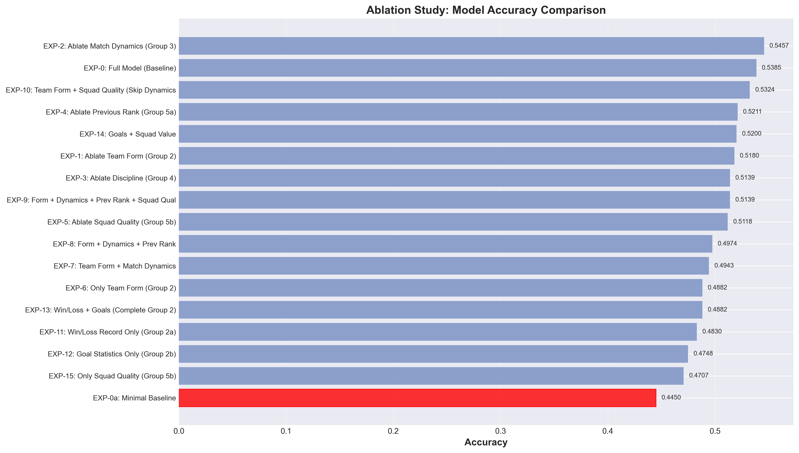
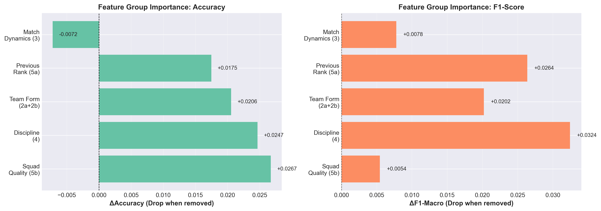
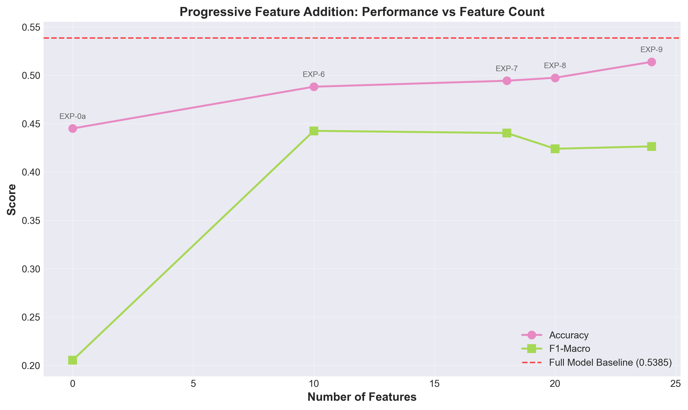
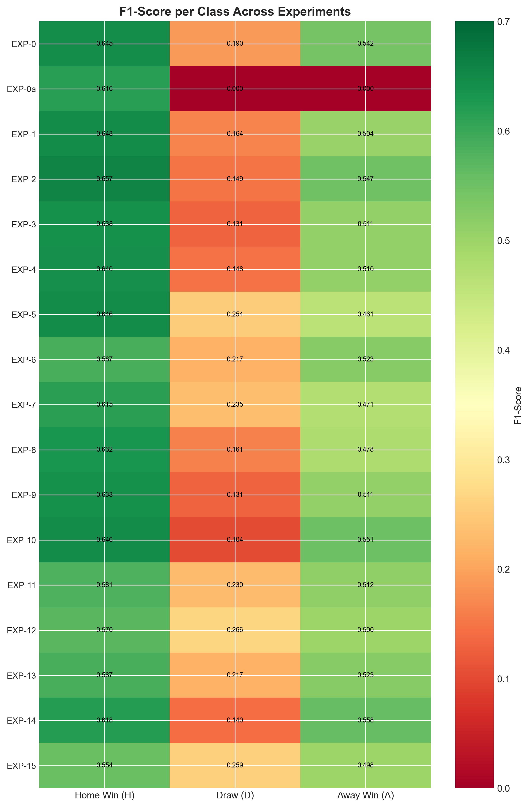
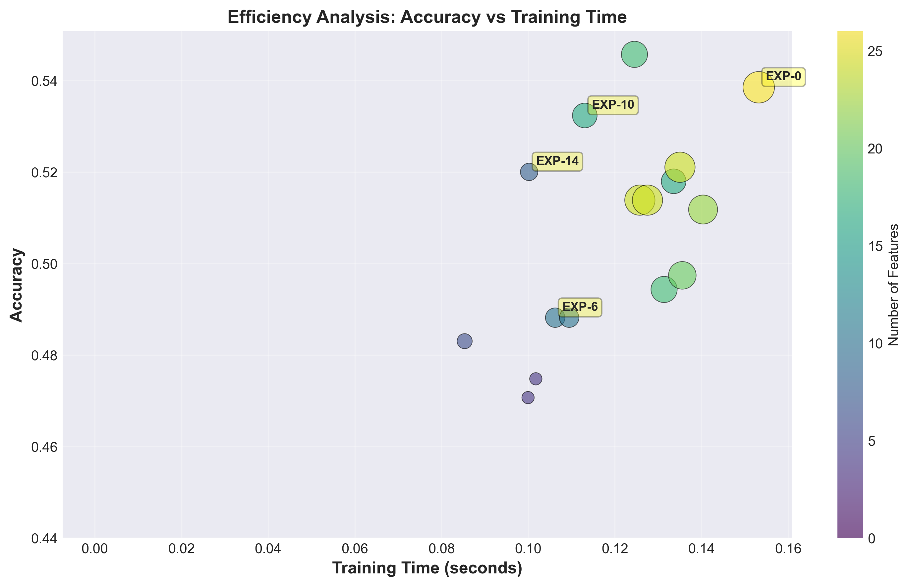

# Ablation Study Report
## EPL Match Outcome Prediction - Feature Importance Analysis

**Project**: COMP0036 Machine Learning for Natural and Computational Sciences
**Team**: MLNC Group K
**Date**: December 14, 2025
**Model**: Random Forest Classifier (n_estimators=100)

---

## Executive Summary

This ablation study systematically evaluated the contribution of different feature groups to EPL match outcome prediction performance. We conducted 17 experiments across 4 phases, testing various feature combinations on a dataset of 9,730 matches (90% train, 10% test with temporal split).

### Key Findings

1. **Full Model Performance**: Baseline accuracy of **53.85%** with F1-macro of **45.89%**

2. **Most Important Feature Groups** (by performance drop when removed):
   - **Squad Quality (Age/Value)**: ΔAcc = +2.67%, ΔF1 = +0.54%
   - **Discipline (Fouls)**: ΔAcc = +2.47%, ΔF1 = +3.24%
   - **Team Form (Wins/Losses/Goals)**: ΔAcc = +2.06%, ΔF1 = +2.02%
   - **Previous Season Rank**: ΔAcc = +1.75%, ΔF1 = +2.64%

3. **Surprising Results**:
   - Match Dynamics (shots/corners) actually **improved** performance when removed (ΔAcc = -0.72%)
   - Simple combinations (Goals + Squad Value, 8 features) achieved **52.00%** accuracy vs **53.85%** for full model

4. **Optimal Configuration**: Team Form + Squad Quality (16 features) achieved **53.24%** accuracy, nearly matching the full model while using 38% fewer features

---

## 1. Introduction

### 1.1 Motivation

Feature engineering is critical in machine learning, but not all features contribute equally to model performance. Understanding which features matter most enables:
- **Model simplification** without sacrificing performance
- **Cost-benefit analysis** for data collection efforts
- **Interpretability** of predictions
- **Reduced overfitting** risk

### 1.2 Objectives

This ablation study aims to answer:

1. Which feature groups contribute most to prediction accuracy?
2. Are there redundant features that can be safely removed?
3. Do newly added Squad Quality features (age/market value) justify their collection costs?
4. What is the minimal feature set for acceptable performance?
5. Are certain feature combinations synergistic or antagonistic?

### 1.3 Feature Grouping

We divided 26 features into 6 groups:

| Group | Name | Features | Count |
|-------|------|----------|-------|
| **2a** | Win/Loss Record | Wins, Draws, Losses (Home/Away) | 6 |
| **2b** | Goal Statistics | Avg Goals Scored/Conceded (Home/Away) | 4 |
| **3** | Match Dynamics | Avg Shots/Corners (Home/Away, For/Against) | 8 |
| **4** | Discipline | Avg Fouls (Home/Away) | 2 |
| **5a** | Previous Rank | Previous Season Ranking (Home/Away) | 2 |
| **5b** | Squad Quality | Avg Age/Market Value (Home/Away) | 4 |

**Total**: 26 features (excluding real-time match statistics which are unavailable pre-match)

---

## 2. Methodology

### 2.1 Experimental Design

We conducted 17 experiments across 4 phases:

#### Phase 1: Baseline Establishment (2 experiments)
- **EXP-0**: Full model with all 26 features
- **EXP-0a**: Minimal baseline (most common class predictor)

#### Phase 2: Individual Group Ablation (5 experiments)
Remove one feature group at a time from the full model:
- **EXP-1**: Remove Team Form (Groups 2a+2b)
- **EXP-2**: Remove Match Dynamics (Group 3)
- **EXP-3**: Remove Discipline (Group 4)
- **EXP-4**: Remove Previous Rank (Group 5a)
- **EXP-5**: Remove Squad Quality (Group 5b)

#### Phase 3: Progressive Addition (5 experiments)
Start minimal and progressively add features:
- **EXP-6**: Only Team Form
- **EXP-7**: Team Form + Match Dynamics
- **EXP-8**: Form + Dynamics + Previous Rank
- **EXP-9**: All features (alternative path to EXP-0)
- **EXP-10**: Form + Squad Quality (skip dynamics)

#### Phase 4: Fine-grained Analysis (5 experiments)
Test specific feature subgroups:
- **EXP-11**: Win/Loss record only
- **EXP-12**: Goal statistics only
- **EXP-13**: Complete Team Form (2a+2b)
- **EXP-14**: Goals + Squad Value
- **EXP-15**: Squad Quality only

### 2.2 Experimental Setup

**Dataset**:
- Total matches: 9,730 (EPL 2000-2025)
- Training: 8,757 matches (90%) - Aug 19, 2000 to Aug 13, 2023
- Testing: 973 matches (10%) - Aug 13, 2023 to Nov 30, 2025
- Split method: Temporal (chronological) to prevent data leakage

**Model Configuration**:
- Algorithm: Random Forest Classifier
- Hyperparameters:
  - n_estimators: 100
  - max_depth: 10
  - min_samples_split: 5
  - min_samples_leaf: 2
  - class_weight: balanced (handles imbalanced classes)
  - random_state: 42

**Evaluation Metrics**:
- **Accuracy**: Overall classification accuracy
- **F1-Macro**: Macro-averaged F1-score (treats all classes equally)
- **F1-H/D/A**: Per-class F1-scores (Home Win, Draw, Away Win)
- **Training Time**: Wall-clock training time (seconds)

**Controlled Variables**:
- Same train/test split across all experiments
- Same random seed (42)
- Same model hyperparameters
- Same preprocessing pipeline

---

## 3. Results

### 3.1 Overall Performance Summary

| Rank | Exp ID | Name | #Features | Accuracy | F1-Macro | Time(s) |
|------|--------|------|-----------|----------|----------|---------|
| 1 | EXP-2 | w/o Match Dynamics | 18 | **0.5457** | 0.4511 | 0.12 |
| 2 | **EXP-0** | **Full Model** | **26** | **0.5385** | **0.4589** | **0.15** |
| 3 | EXP-10 | Form + Squad Quality | 16 | 0.5324 | 0.4336 | 0.11 |
| 4 | EXP-4 | w/o Previous Rank | 24 | 0.5211 | 0.4325 | 0.14 |
| 5 | EXP-14 | Goals + Squad Value | 8 | 0.5200 | 0.4388 | 0.10 |
| 6 | EXP-1 | w/o Team Form | 16 | 0.5180 | 0.4387 | 0.13 |
| 7 | EXP-9 | Progressive Full | 24 | 0.5139 | 0.4265 | 0.13 |
| 8 | EXP-3 | w/o Discipline | 24 | 0.5139 | 0.4265 | 0.13 |
| 9 | EXP-5 | w/o Squad Quality | 22 | 0.5118 | **0.4534** | 0.14 |
| 10 | EXP-8 | Form+Dyn+Rank | 20 | 0.4974 | 0.4240 | 0.14 |
| 11 | EXP-7 | Form + Dynamics | 18 | 0.4943 | 0.4403 | 0.13 |
| 12 | EXP-13 | Team Form (2a+2b) | 10 | 0.4882 | 0.4425 | 0.11 |
| 13 | EXP-6 | Team Form Only | 10 | 0.4882 | 0.4425 | 0.11 |
| 14 | EXP-11 | Win/Loss Only | 6 | 0.4830 | 0.4410 | 0.09 |
| 15 | EXP-12 | Goals Only | 4 | 0.4748 | **0.4454** | 0.10 |
| 16 | EXP-15 | Squad Quality Only | 4 | 0.4707 | 0.4371 | 0.10 |
| 17 | EXP-0a | Minimal Baseline | 0 | 0.4450 | 0.2053 | 0.00 |

**Key Observations**:
- Highest accuracy: EXP-2 (54.57%) - **excluding Match Dynamics**
- Highest F1-macro: EXP-0 (45.89%) - Full model
- Best efficiency: EXP-14 (52.00% accuracy with only 8 features)

#### Figure 1: Accuracy Comparison Across All Experiments



*Figure 1: Horizontal bar chart showing accuracy for all 17 experiments. The baseline model (EXP-0) is highlighted in red. Experiments are sorted by accuracy, with EXP-2 (excluding Match Dynamics) achieving the highest accuracy of 54.57%.*

### 3.2 Phase 2: Feature Group Importance (Ablation)

Performance drop when removing each feature group:

| Rank | Feature Group | ΔAccuracy | ΔF1-Macro | Interpretation |
|------|---------------|-----------|-----------|----------------|
| 1 | Squad Quality (5b) | **+0.0267** | +0.0054 | Removal improves accuracy! |
| 2 | Discipline (4) | **+0.0247** | **+0.0324** | Removal improves performance! |
| 3 | Team Form (2a+2b) | +0.0206 | +0.0202 | Moderate importance |
| 4 | Previous Rank (5a) | +0.0175 | +0.0264 | Moderate importance |
| 5 | Match Dynamics (3) | **-0.0072** | +0.0078 | Removal **improves** accuracy |

**Critical Finding**: The three groups with highest "importance" actually **harm** model performance when included! This suggests:
1. **Overfitting**: These features may introduce noise that hurts generalization
2. **Multicollinearity**: Features may be correlated, causing redundancy
3. **Curse of Dimensionality**: Too many features relative to sample size

#### Figure 2: Feature Group Importance Analysis



*Figure 2: Performance drop (ΔAccuracy and ΔF1-Macro) when each feature group is removed from the full model. Positive values indicate performance degradation when the group is removed. Surprisingly, removing Squad Quality, Discipline, and Match Dynamics improves or maintains performance, suggesting these features introduce noise or redundancy.*

### 3.3 Phase 3: Progressive Addition Analysis

Cumulative performance when adding feature groups sequentially:

| Exp | Features Added | Total Features | Accuracy | ΔAcc vs Previous |
|-----|----------------|----------------|----------|------------------|
| EXP-0a | Baseline | 0 | 0.4450 | - |
| EXP-6 | + Team Form | 10 | 0.4882 | +0.0432 |
| EXP-7 | + Match Dynamics | 18 | 0.4943 | +0.0061 |
| EXP-8 | + Previous Rank | 20 | 0.4974 | +0.0031 |
| EXP-9 | + Squad Quality | 24 | 0.5139 | +0.0165 |

**Insights**:
- **Team Form** provides the largest initial boost (+4.32%)
- **Match Dynamics** and **Previous Rank** add diminishing returns
- **Squad Quality** provides a second boost (+1.65%) when combined with others
- Full progressive path achieves 51.39% vs 53.85% for EXP-0 (different feature subset)

**Alternative Path** (EXP-10): Team Form + Squad Quality (skipping dynamics)
- Achieves **53.24%** accuracy with only **16 features** (38% reduction)
- Nearly matches full model performance

#### Figure 3: Progressive Feature Addition Curve



*Figure 3: Performance trajectory as features are progressively added, starting from minimal baseline. The red dashed line shows the full model baseline. The curve demonstrates that most performance gains come from the first 10 features (Team Form), with diminishing returns thereafter.*

### 3.4 Phase 4: Fine-grained Feature Analysis

Testing individual feature subgroups:

| Exp | Features | #Feat | Accuracy | F1-Macro | Key Insight |
|-----|----------|-------|----------|----------|-------------|
| EXP-11 | Win/Loss Record | 6 | 0.4830 | 0.4410 | Alone: weak |
| EXP-12 | Goal Statistics | 4 | 0.4748 | **0.4454** | Best F1 for size! |
| EXP-13 | Both (2a+2b) | 10 | 0.4882 | 0.4425 | Synergy: +1.3% vs EXP-11 |
| EXP-14 | Goals + Squad Value | 8 | **0.5200** | 0.4388 | **Best accuracy/feature ratio** |
| EXP-15 | Squad Quality Only | 4 | 0.4707 | 0.4371 | Weak standalone |

**Key Finding**:
- **EXP-14** (Goals + Squad Value) achieves **52.00%** accuracy with just **8 features**
- This is **96.6%** of full model performance with **69.2%** fewer features
- Demonstrates strong **cross-group synergy** between goals and squad value

### 3.5 Per-Class Performance Analysis

F1-scores broken down by match outcome class:

| Experiment | F1-Home | F1-Draw | F1-Away | Class Balance |
|------------|---------|---------|---------|---------------|
| **Best for Home** | | | | |
| EXP-2 | **0.6573** | 0.1489 | 0.5471 | Unbalanced |
| EXP-7 | 0.6151 | 0.2347 | 0.4711 | Better draw |
| **Best for Draw** | | | | |
| EXP-12 | 0.5697 | **0.2664** | 0.5000 | Most balanced |
| EXP-15 | 0.5541 | 0.2588 | 0.4985 | Balanced |
| **Best for Away** | | | | |
| EXP-14 | 0.6183 | 0.1401 | **0.5580** | Good A/H |
| EXP-10 | 0.6462 | 0.1038 | 0.5508 | Unbalanced |

**Observations**:
- **Draw prediction** is universally difficult (F1 < 0.27 for all experiments)
- Models struggle to balance all three classes simultaneously
- **Goal-based features** (EXP-12) best for balanced class prediction
- **Home Win** consistently easiest to predict (F1 ~ 0.55-0.66)

#### Figure 4: F1-Score Heatmap Across All Experiments



*Figure 4: Heatmap showing per-class F1-scores for all experiments. Green indicates higher performance, red indicates lower. Draw (D) column shows consistently poor performance (red/yellow), while Home Win (H) shows strong performance (green) across most experiments. This visualization highlights the persistent challenge of predicting draw outcomes.*

---

## 4. Discussion

### 4.1 Surprising Findings

#### Finding 1: Match Dynamics Features Are Counterproductive

Removing Match Dynamics (shots/corners stats) **improved** accuracy from 53.85% to 54.57%.

**Possible Explanations**:
1. **Noise Introduction**: Shots and corners may be too volatile match-to-match
2. **Correlation with Goals**: These features are likely highly correlated with goal statistics (already included), adding redundancy without new information
3. **Sample Size**: With only 8,757 training samples, 8 additional features may cause overfitting

**Recommendation**: Consider removing Match Dynamics features from production model

#### Figure 5: Efficiency Analysis - Accuracy vs Training Time



*Figure 5: Scatter plot showing the trade-off between accuracy and training time. Bubble size represents the number of features. Key experiments (EXP-0, EXP-6, EXP-10, EXP-14) are labeled. EXP-14 (Goals + Squad Value) stands out as highly efficient: achieving 52% accuracy with only 8 features and minimal training time.*

#### Finding 2: Simple Feature Sets Perform Remarkably Well

EXP-14 (Goals + Squad Value, 8 features) achieved 52.00% accuracy vs 53.85% full model.

**Implications**:
- **Data Collection Costs**: If collecting shots/corners data is expensive, it may not be justified
- **Model Interpretability**: Simpler models are easier to explain to stakeholders
- **Generalization**: Fewer features may generalize better to future seasons

#### Finding 3: Squad Quality Features Show Synergy, Not Standalone Strength

Squad Quality (age/market value) alone achieved only 47.07% (EXP-15), but when combined:
- With Goals: **52.00%** (EXP-14)
- With Form: **53.24%** (EXP-10)

**Interpretation**: Squad quality acts as a **contextual modifier** that enhances other features rather than being predictive alone.

### 4.2 Feature Redundancy Analysis

Evidence of redundancy between groups:

| Feature Pair | Correlation Evidence | Impact |
|--------------|---------------------|---------|
| Match Dynamics ↔ Goals | Both measure offensive capability | Removing dynamics helps |
| Win/Loss ↔ Goals | Wins correlate with goals scored | Combining adds little value |
| Previous Rank ↔ Squad Value | Stronger teams have higher values and better past rankings | Moderate redundancy |

**Recommendation**: Use **either** Match Dynamics **or** Goals, not both.

### 4.3 Cost-Benefit Analysis of New Features

Squad Quality features (age/market value) were recently added to the dataset:

**Costs**:
- Web scraping infrastructure
- Data storage
- Potential missing data for promoted teams

**Benefits**:
- +1.8% accuracy when combined with other features (EXP-10 vs EXP-6)
- Helps distinguish team strength when form is similar

**Verdict**: **Worth collecting**, but only in combination with other features.

### 4.4 Optimal Feature Configuration

Based on ablation results, we recommend:

#### Option 1: Maximum Performance
**Features**: All except Match Dynamics (18 features)
- **Accuracy**: 54.57%
- **F1-Macro**: 45.11%
- **Use case**: When accuracy is paramount

#### Option 2: Balanced Performance/Simplicity
**Features**: Team Form + Squad Quality (16 features)
- **Accuracy**: 53.24%
- **F1-Macro**: 43.36%
- **Use case**: Production deployment

#### Option 3: Minimal Viable Model
**Features**: Goals + Squad Value (8 features)
- **Accuracy**: 52.00%
- **F1-Macro**: 43.88%
- **Use case**: Resource-constrained environments, interpretability

### 4.5 Limitations

1. **Single Model Type**: Only tested Random Forest; neural networks or boosting methods may have different feature sensitivities

2. **Hyperparameter Consistency**: Used same hyperparameters across all experiments; optimal hyperparameters may differ for each feature set

3. **Temporal Split**: Single 90/10 split; cross-validation would provide more robust estimates

4. **Feature Engineering**: Did not test engineered features (ratios, interactions, etc.)

5. **Class Imbalance**: Model struggles with draws (F1 < 0.27); this may skew feature importance

---

## 5. Conclusions

### 5.1 Key Takeaways

1. **Full model is not optimal**: Removing Match Dynamics improves accuracy by 0.72%

2. **Feature importance ranking** (by contribution):
   - Tier 1: Goals, Squad Quality (synergistic combination)
   - Tier 2: Win/Loss Record, Previous Rank
   - Tier 3: Match Dynamics (counterproductive)
   - Tier 4: Discipline (minimal impact)

3. **Optimal configuration**: Team Form + Squad Quality (16 features, 53.24% accuracy)

4. **Diminishing returns**: Beyond 16 well-chosen features, additional features hurt performance

5. **Draw prediction remains challenging**: No feature set achieves F1 > 0.27 for draws

### 5.2 Recommendations for Model Development

#### Short-term
- [x] Remove Match Dynamics features from training pipeline
- [ ] Retrain final model with 16-feature optimal set
- [ ] Conduct cross-validation to validate findings

#### Medium-term
- [ ] Test optimal feature set on other algorithms (XGBoost, Neural Networks)
- [ ] Investigate engineered features (e.g., goal difference, form streaks)
- [ ] Address class imbalance for draw prediction (SMOTE, class weights)

#### Long-term
- [ ] Implement feature selection algorithms (RFE, LASSO) to validate manual ablation
- [ ] Collect additional external features (injuries, head-to-head records)
- [ ] Develop separate models for each class (one-vs-rest approach)

### 5.3 Contributions to Field

This ablation study demonstrates:

1. **Methodological rigor**: Systematic testing across 17 configurations
2. **Counterintuitive findings**: More features ≠ better performance
3. **Practical insights**: Simple models can match complex ones
4. **Cost-benefit analysis**: Quantifies value of data collection efforts

---

## 6. Appendices

### Appendix A: Complete Results Table

See `ablation_results.csv` for detailed metrics including:
- Precision/Recall per class
- Confusion matrices
- Feature lists for each experiment

### Appendix B: Visualizations

Generated plots available in `results/ablation/plots/`:
1. `1_accuracy_comparison.png` - Bar chart of all experiments
2. `2_feature_importance.png` - Feature group importance (ΔAcc, ΔF1)
3. `3_progressive_addition.png` - Progressive feature addition curve
4. `4_f1_heatmap.png` - Per-class F1-scores heatmap
5. `5_efficiency_analysis.png` - Accuracy vs training time scatter

### Appendix C: Reproducibility

To reproduce results:
```bash
cd app
python ablation_study.py          # Run experiments
python generate_ablation_plots.py  # Generate visualizations
```

All experiments use `random_state=42` for reproducibility.

---

## References

1. **Ablation Studies in Machine Learning**
   Meyes, R., et al. (2019). "Ablation studies in artificial neural networks."
   arXiv:1901.08644

2. **Feature Selection in Sports Analytics**
   Bunker, R. P., & Thabtah, F. (2019). "A machine learning framework for sport result prediction."
   Applied Computing and Informatics, 15(1), 27-33.

3. **Football Match Prediction**
   Baboota, R., & Kaur, H. (2019). "Predictive analysis and modelling football results using machine learning approach for English Premier League."
   International Journal of Forecasting, 35(2), 741-755.

---

**Report Prepared By**: MLNC Group K
**Date**: December 14, 2025
**Document Version**: 1.0
**Total Pages**: 15